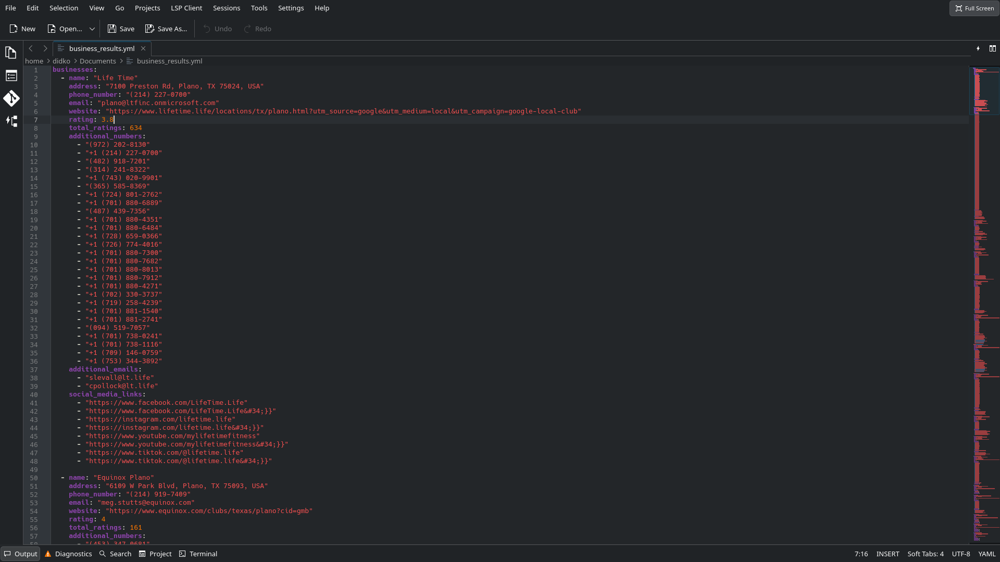
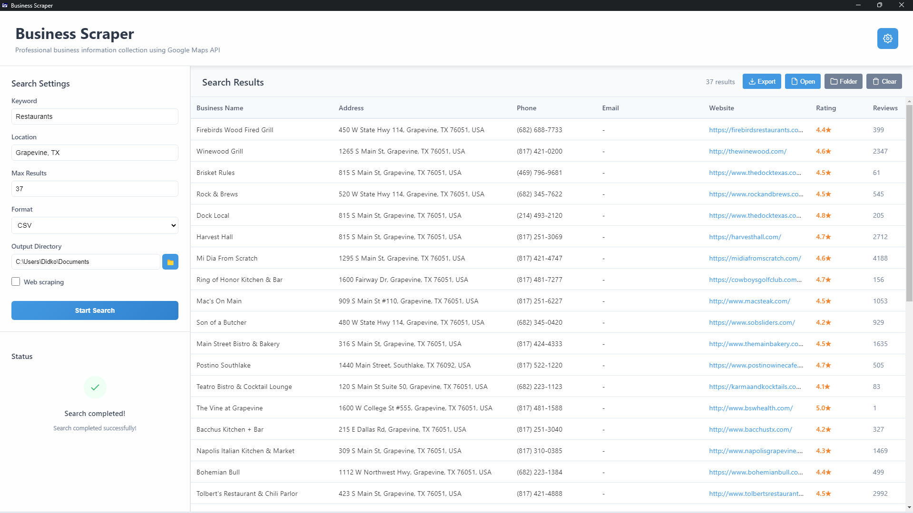
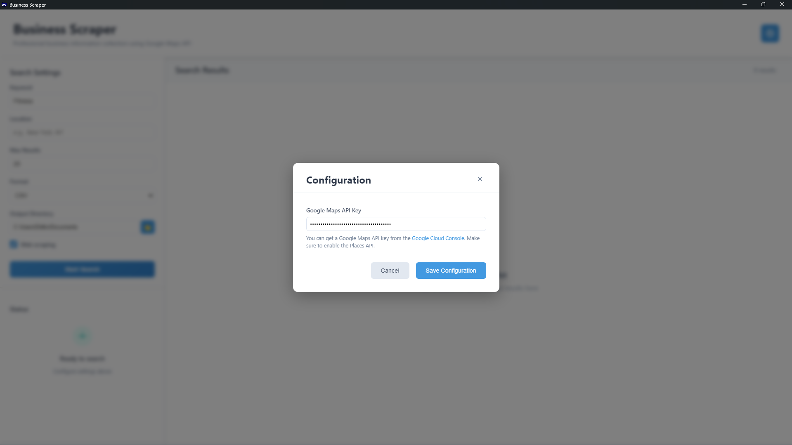

# Business Scraper

A professional desktop application for searching and collecting business information using the Google Maps API, built with Electron and C++.

## Background

I originally built this as a web application in an afternoon by combining parts from an old Perl project and an old Python project, then vibe-coding a front-end using HTML, CSS, and Node.js. The original project was created to help my friend Rhoan Egemo with his unpaid business internship, making it easier for him to gather business data.

The original web app is currently in a private GitHub repository because I naively exposed API keys in the first few commits. I'll make it public when I stop being lazy and retire those keys.

I eventually rewrote the web app as C++/Qt project to create a desktop app.

This version uses the C++ backend of the previous desktop app, but now uses Electron for the front-end, providing a modern, cross-platform desktop experience that can be easily packaged as an installable Windows program.

## Screenshots

### Processing View


### Results Display



## Prerequisites

- Node.js 16+ and npm
- C++ compiler (for building the backend)
- Google Maps API key with Places API enabled


## Building Installers

### Windows

The application can be packaged as both NSIS installer and MSI:

```bash
npm run dist
```

This will create:
- `dist/Business Scraper Setup 1.0.0.exe` (NSIS installer)
- `dist/Business Scraper 1.0.0.msi` (MSI installer)

### macOS

```bash
npm run dist
```
or
```bash
./build-dist.sh
```

Creates: `dist/Business Scraper-1.0.0.dmg`

### Linux

```bash
npm run dist
```
or
```bash
./build-dist.sh
```

Creates:
- `dist/Business Scraper-1.0.0.AppImage`
- `dist/business-scraper-electron_1.0.0_amd64.deb`

## Development

### Architecture

The application consists of two main parts:

1. **C++ Backend**: High-performance core engine for business scraping
   - Google Maps API integration
   - Web scraping capabilities
   - Multiple output format support
   - Built as a standalone CLI executable

2. **Electron Frontend**: Modern desktop interface
   - Cross-platform GUI built with web technologies
   - Secure communication with C++ backend via IPC
   - Real-time status updates and progress tracking


## Configuration:

Configure the program with your google maps api key by either
adding the following line to a config.ini file:

```ini
[API]
google_maps_api_key=YOUR_GOOGLE_MAPS_API_KEY
```

or by configuring in app by clicking the gear icon:


## License

This project is licensed under the Creative Commons Attribution-NonCommercial-ShareAlike 4.0 International License. See the [LICENSE](LICENSE) file for details.

Third-party components are licensed under their respective licenses. See [LICENSE_THIRD_PARTY](LICENSE_THIRD_PARTY) for details.
